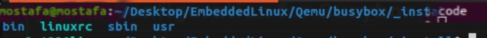
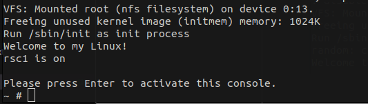

# BusyBox

BusyBox stands as a versatile software suite, offering essential Unix utilities in a single executable file. It finds utility in embedded systems and resource-constrained environments like routers, set-top boxes, and similar small devices operating on Linux.

## 1. Download BusyBox

```bash
git clone https://github.com/mirror/busybox.git
cd busybox/
```

# 2. Configuration for BusyBox!

Choose the appropriate board toolchain and architecture to compile binaries compatible with your board.

##### for Vexpress Cortexa9  Qemu

```
export CROSS_COMPILE=<Path To the Compiler>/arm-cortexa9_neon-linux-musleabihf-
export ARCH=arm
```

##### for Raspberry pi 4 - 64

```
export CROSS_COMPILE=<Path To Compiler>/aarch64-linux-gnu-
export ARCH=arm64

```

**Configure busybox to be static build from menuconfig:**

```
make menuconfig
```

**build the busybox to get the minimal command:**

```
make -j12
```

**Generate Rootfs:**

#The output will be in _install directory, containing all necessary files and binaries
make install




# 3. Prepare Rootfs

```
# to go out from busybox directory
cd ..

# create directory rootfs
mkdir rootfs

# copy the content inside the _install into rootfs
cp -rp ./busybox/_install/ ./rootfs

# change directory to rootfs
cd rootfs

# change rootfs owner to be root
sudo chown -R root:root *

# create the rest folder for rootfs
mkdir -p ./dev ./etc ./sys ./proc

# create dir for init process
mkdir ./etc/init.d

#create inittab file
touch ./etc/inittab
```
# 4. System Configuration Busybox init process
```
The first user space program that gets executed by the kernel is `/sbin/init` and its configuration
file is `/etc/inittab`.

Here inittab first run rcS script

```
::sysinit:/etc/init.d/rcS
::sysinit:/etc/init.d/rcS1
ttyAMA0::askfirst:-/bin/sh
::restart:/sbin/init
#::shutdown:/etc/init.d/rcK1
```

rcS script is created in `init.d` its role to  just mount dev  if not auto mounted by kernel [devtmpfs] , mount proc , mount sys

**Do:**

```
 vim ./etc/init.d/rcS
```

```
#!/bin/sh
mount -t devtmpfs none /dev
mount -t proc nodev /proc
mount -t sysfs nodev /sys
echo "Welcome to my Linux!"
```

**rcS1 script has our simple app to test initprocess**

```
vim ./etc/init.d/rcS1

#!/bin/sh
echo "rsc1 is on"
TestDeamon >/dev/null  &
```

**TestDeamon** is an app compiled by arm-a9 cross-compiler , it will run after rcS and then shell will start . [folder attached here (**InitApp**)]

**Note** : if  you developed your app and compiled it dynamically you should copy ~/x-tools/arm-cortexa9_neon-linux-musleabihf/arm-cortexa9_neon-linux-musleabihf/sysroot/*  to your Rootfs as it'll depend on musl libs

**rcK1 script to kill our TestDeamon**

```
vim ./etc/init.d/rcK1
#!/bin/sh
echo "shutdown deamon app"
pkill -e TestDeamon
sleep 3
```

**That was simple init process for our rootfs**

# 5. Rootfs to SD card
```
**Mounting for physical SD :**

```
sudo mount /dev/sd<x> /media/SDCARD
```

**Mounting For Virtual SD** :  check u-boot section to know more about virtual SD

```
sudo mount /dev/loop<>p2 <PATH>/SD/rootfs  
```

Now at rootfs directory that has all our files and bins

```
cd rootfs
cp -r * <PATH>/SD/rootfs
```

Now SD/rootfs partition is loaded with our fs

# 6. Test with uboot

This sets your rootfs  be loaded from block 2 of SD card

```
setenv bootargs console=ttyAMA0,115200n8 root=/dev/mmcblk0p2 rootfstype=ext4 rw rootwait init=/sbin/init
```

# 7. Result

!

# 8. Load Rootfs from Network serevr ?

#### **####Check NFS section and give it a try to do that :D ####**